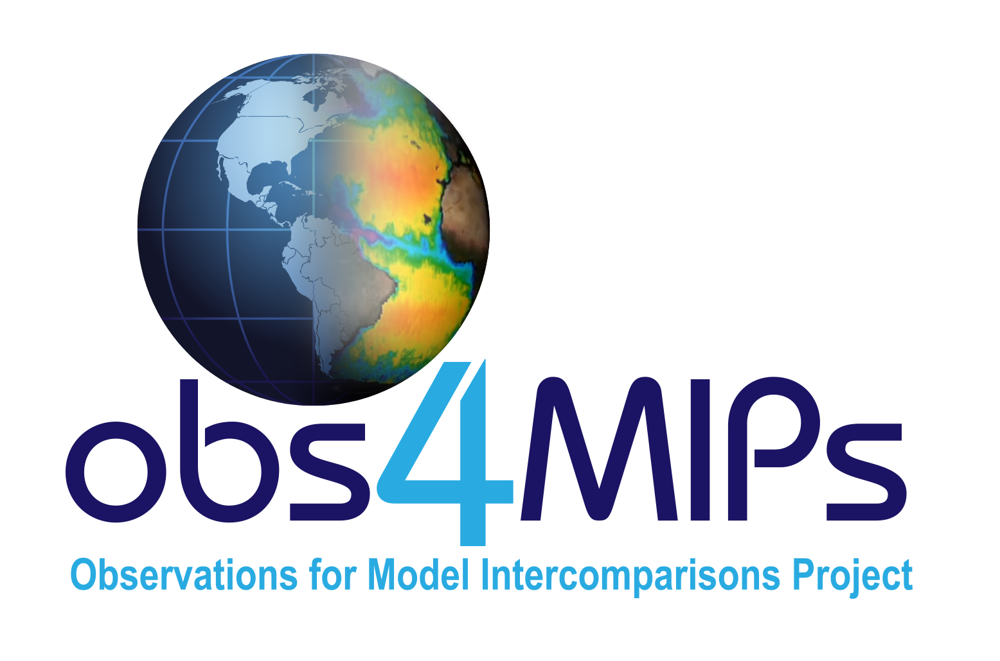

## obs4MIPs-cmor-tables ##

This repo is used to develop and maintain:

- Version control of **obs4MIPs compliant [source_ids](https://github.com/PCMDI/obs4MIPs-cmor-tables/blob/master/obs4MIPs_source_id.json)** 
- Maintenance of [obs4MIPs CMOR tables (json files)](https://github.com/PCMDI/obs4MIPs-cmor-tables/tree/master/Tables)
- Version controlled documentation of processing codes to used to prepare obs4MIPs compliant data
- Selected demos for perparing obs4MIPs compliant data
- Up-to-date obs4MIPs Controlled Vocabulary (CVs; json files) including: 
    - source_id
    - nominal_resolution
    - frequency
    - many other required_global_attributes 

## Implementation of new source_ids 

The pathway for proposing a new source_id is via submission of an issue on this repo. When submitting an issue, a template is provided for contributors to modify for their proposed source_id.  Once the issue is submitted, one of the site maintainers will review it and when ready will execute its implementation into the [database of source_ids](https://github.com/PCMDI/obs4MIPs-cmor-tables/blob/master/obs4MIPs_source_id.json) maintained on this repo.. 
